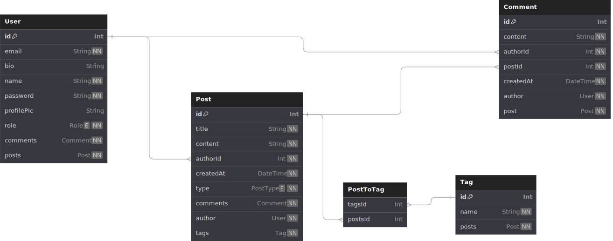

# veterinary-social-network

## Description

This project encompasses both the backend and a minimal frontend
for an application intended for veterinarians, providing the ability
to share information about various animal conditions,
including explanatory texts and relevant images.
This platform not only enables knowledge sharing
but also supports the continuous learning of veterinary professionals.

## Available roles

1. Guest
    1. Guest only has access to see posts and comments.
    2. Guest can also filter post by tag or sort them by creation date.
2. User
    1. User can create/edit/delete his own posts.
    2. User can add comments to posts.
    3. User can edit his own comments.
    4. User can edit his own profile.
    5. User can delete his own account.
3. Admin
    1. Admin has full access to create/edit/delete posts and comments.
    2. Admin has access to delete users.

## Project structure

- prisma
    - dbml
        - schema.dbml (dbml file to visualise the Entity-Relationship Diagram with ` dbdiagram.io`)
    - schema.prisma

- src
    - controllers
    - middlewares
    - routes
    - services
    - utils
    - validations

- static
    - views (nunjucks templates for frontend)

## Project setup

- Clone project
- Create a .env file
- Add variables
    - `DB_LINK` <- for your database connection string
    - `GOOGLE_CLIENT_ID` <- for Google Oauth
    - `GOOGLE_CLIENT_SECRET` <- for Google Oauth
    - `CLOUD_NAME` <- for image upload (cloudinary)
    - `CLOUDINARY_API_KEY`  <- for image upload (cloudinary)
    - `CLOUDINARY_API_SECRET`  <- for image upload (cloudinary)
    - `JWTSECRET` <- secret for jwt authentication
- Run `npm install` for installing necessary packages
- Run `npm start` for run app

## Database diagram



## Flow Chart Diagram
```

                                        ┌───────┐                                    
                                        │ start │                                    
                                        └───┬───┘          ┌─────────────────┐       
                                            │         ┌───►│filter/sort posts│       
                                            │         │    └─────────────────┘       
                                            ▼         │                              
                                         ┌─────┐      │    ┌────────────────────┐    
  ┌─────────────────────────────────────►│guest├──────┴───►│view posts/comments │    
  │                                      └──┬──┘           └────────────────────┘    
  │                                         │                                        
  │                                         │                                        
  │                                         │                                        
  │                                         ▼                                        
  │                                ┌────────────────┐                                
  │                                │ signup / login │                                
  │                                └────┬─────┬─────┘                                
  │                                     │     │                                      
  │                            ┌────┐   │     │    ┌─────┐                           
  │        ┌───────────────────┤user│◄──┘     └───►│admin├─────┐                     
  │        │                   └──┬─┘              └─┬───┘     │                     
  │        │                      │                  │         │                     
  │        │   ┌──────────────────▼───────┐          │  ┌──────▼───────────────────┐ 
  │        │   │edit own pots and comments│          │  │edit all pots and comments│ 
  │        │   └──────────────────────────┘          │  └──────────────────────────┘ 
  │        │                                         │                               
  │        │                                         │  ┌───────────────────────────┐
  │        │       ┌─────────────────────────────┐   ├─►│delete users posts/comments│
  │        ├──────►│delete his own posts/comments│   │  └───────────────────────────┘
  │        │       └─────────────────────────────┘   │                               
  │        │                                         │  ┌────────────┐               
  │        │                                         ├─►│delete users│               
  │        │       ┌──────────────────┐              │  └────────────┘               
  │        ├──────►│delete his account│              │                               
  │        │       └───────────┬──────┘              │                               
  │        │                   │                     │  ┌──────────────────┐         
  │        │       ┌──────┐    │                     ├─►│delete his account├─────┐   
  │        └──────►│logout├────┤                     │  └──────────────────┘     │   
  │                └──────┘    │                     │                           │   
  │                            │                     │  ┌──────┐                 │   
  │                            │                     └─►│logout├─────────────────┤   
  └───────────────────────────┬┘                        └──────┘                 │   
                              │                                                  │   
                              └──────────────────────────────────────────────────┘                                                                          


```
## API Documentation

## <u>Auth</u>

### GET : http://localhost:3000/signup

Available for all.

Used for creating an account.
Renders a form to be filled in order to create an account
and gives the alternative to log in if you have already an account.

### POST : http://localhost:3000/signup

Used for creating an account.

Request body:

  ``` json
    {
    "email": <String>,
    "password": <String>,
    "name": <String>
   }
  ```

It will check if already exists a user with given email.
If there is, an error message will be displayed in the console
and it will be redirected to sign form.

### GET : http://localhost:3000/login

Available for all.

Used for log into an account.
Renders a form to be filled in order to log in
and gives the alternative to sign in or to log in with Google account.

### POST : http://localhost:3000/login

Available for all.

Request body:

  ``` json
    {
    "email": <String>,
    "password": <String>
   }
  ```

It verifies if user exist and password provided is correct the generates
a JWT token that is stored in the current session.
If login fails, it redirects to log in form otherwise it redirects to main page.

### GET : http://localhost:3000/logout

Available only for users and admins.

Destroy the current session. If it fails, it will respond with the
code status 500 otherwise it will redirect to login.

### GET : http://localhost:3000/auth/google

Initiates the Google OAuth 2.0 authentication flow

### GET : http://localhost:3000/auth/google/callback

Callback URL for handling the OAuth 2.0 response

## <u>Post</u>

### GET : http://localhost:3000/

Available for all.

Displays posts and options to sort by date and to filter by tag name.

If guest is log as a user it displays buttons for creating a post ,
edit /delete his own posts ,add comment, edit his comments or view/edit profile.

If guest logs as an admin it displays buttons for creat/edit/delete all posts ,
add/edit/delete comments, manage users or view/edit profile.

### GET : http://localhost:3000/post

Available only for users and admins.

Renders a form to be filled in order to create a new post

### POST : http://localhost:3000/post

Available only for users and admins.

Request body:

  ``` json
    {
    "title": <String>,
    "content": <String>,
    "tags": <String>,
    "type": <String>,
    "imagePath": <String>,
    "userId": <Integer>,
   }
  ```

### GET : http://localhost:3000/post/:id

Available only for users and admins.

Renders a form to be filled in order to modify a post

### PUT: http://localhost:3000/post/:id

Available only for users and admins.

Request body:

``` json
    {
    "title": <String>,
    "content": <String>,
    "tags": <String>,
    "type": <String>,
    "imagePath": <String>,
    "userId": <Integer>,
   }
  ```

### DELETE: http://localhost:3000/post/:id

Available only for users and admins.

Used for deleting a specific post.

## <u>User</u>

### GET : http://localhost:3000/user/:id

Available only for users and admins.

Renders the user's profile and displays buttons for edit or delete account.

### DELETE: http://localhost:3000/user/:id

Available only for users and admins.

### GET : http://localhost:3000/editProfile/:id

Available only for users and admins.

Renders a form to be filled in order to edit profile information.

### PUT: http://localhost:3000/user/:id

Available only for users and admins.

Request body:

``` json
    {
     "name": <String>,
     "email": <String>, 
     "bio": <String>
    }
```

### GET : http://localhost:3000/users

Only for admins.

Renders all users in order to delete accounts

## <u>Comments</u>

### GET : http://localhost:3000/post/:postId/comments

Available for all.

### GET : http://localhost:3000/post/:postId/comment

Available only for users and admins.

### POST : http://localhost:3000/post/:postId/comment

Available only for users and admins.

Request body:
 ``` json
    {
     "content": <String>
    }
```

### GET : http://localhost:3000/post/:postId/comment/:commentId

Available only for users and admins.


### PUT: http://localhost:3000/post/:postId/comment/:commentId

Available only for users and admins.

Request body:
 ``` json
    {
     "content": <String>
    }
```


### DELETE: http://localhost:3000/post/:postId/comment/:commentId

Available only for users and admins.


